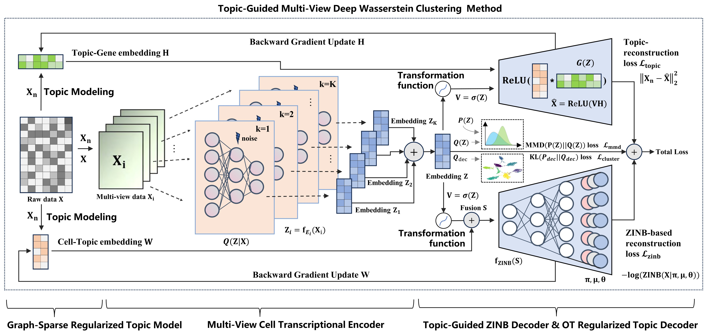

# Topic-Guided Multi-View Deep Wasserstein Clustering for Single-cell Transcriptomic Analysis

[](https://doi.org/10.5281/zenodo.17737123)
[](https://opensource.org/licenses/MIT)
[](https://www.python.org/)


## ✨ Overview
Single-cell RNA sequencing (scRNA-seq) provides unprecedented resolution for genome-wide gene expression profiling at the single-cell level, unveiling intricate details of cellular transcriptomes. However, many existing deep clustering methods often overlook the rich multi-view information inherent in scRNA-seq data, leading to pseudo-variability and potential misinterpretation of cellular states. To address this issue, we introduce scMTO, a novel topic-guided deep multi-view Wasserstein clustering method that seamlessly integrates a deep **M**ulti-view autoencoder with **T**opic modeling and **O**ptimal transport theory to enhance scRNA-seq interpretation. scMTO employs a multi-view transcriptional encoder to capture comprehensive cell embeddings from diverse data perspectives, paired with a graph-sparse regularized topic model to extract key topic features directly from sparse data. Subsequently, guided by these topics, scMTO incorporates an optimal transport regularized topic decoder to align sparse cell topic patterns in the latent space, complemented by a topic-guided zero-inflated negative binomial (ZINB) model to encapsulate the global probability distribution. By jointly optimizing ZINB, the optimal transport, and the Kullback–Leibler divergence losses, scMTO achieves substantial improvements in clustering performance, preserving a latent structure enriched with multi-view information and crucial cell topic patterns. Our comprehensive evaluation on 12 diverse scRNA-seq datasets across multiple sequencing platforms demonstrated scMTO's superiority over existing state-of-the-art clustering methods.



### 🎯 Key Innovations
- **Multi-view Integration**: Combines complementary data representations
- **Interpretable Topics**: Discovers biologically meaningful gene programs  
- **Optimal Transport**: Aligns cellular distributions with theoretical guarantees
- **Scalable Architecture**: Handles large-scale scRNA-seq datasets efficiently

  
## 🚀 Quick Start
First clone the repo and cd into the directory:
```
git clone https://github.com/HKzda210/scMTO.git
cd scMTO
```
Then create a conda env and install the dependencies:
```
conda create -n scmto python=3.9.19
conda activate scmto
pip install -r requirements.txt
```

## 📁 Data Availability
The real data sets we used can be download [here](https://doi.org/10.5281/zenodo.17347360).

## 📊 Tutorials
We provide tutorials showing the clustering performance of scMTO: 

- Single-cell RNA-seq data clustering analysis: [tutorial.ipynb](https://github.com/HKzda210/scMTO/blob/master/tutorial.ipynb).
- Analysis of the large scale scRNA-seq dataset MRCA_BC: [tutorial_scale.ipynb](https://github.com/HKzda210/scMTO/blob/master/tutorial_scale.ipynb).


